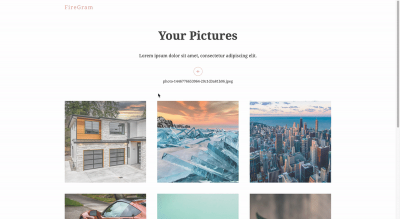

# FIREGRAM

## Checklist

- [x] Intro & Setup
- [x] Firebase Setup
- [x] Upload Form
- [x] Firebase Storage Hook
- [x] Making a Progress Bar
- [x] Firestore Hook & Showing Images
- [x] Creating the Modal
- [x] Adding Animations (Framer Motion)
- [x] Deployment

  
  

